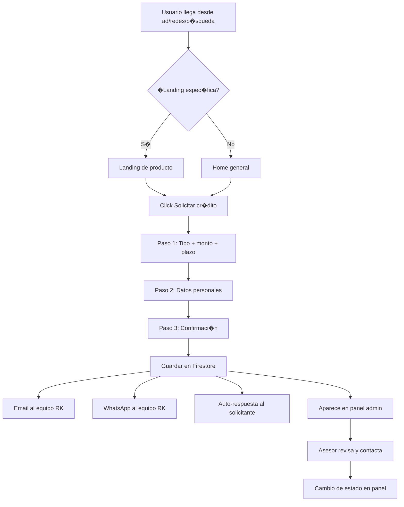

# Propuesta Comercial � Plataforma Digital RK Inversiones

**Cliente:** RK Inversiones  
**Slogan:** *Dinero R�pido y F�cil*  
**Contacto actual:** 829-669-8958 (WhatsApp)  
**Admin principal:** jcamacho-gomez@hotmail.com  
**Fecha:** 7 de julio de 2026  
**Referencia de mercado:** [guimanfer.com](https://guimanfer.com)

---

## 1. Resumen ejecutivo

RK Inversiones es una empresa de financiamiento en Rep�blica Dominicana que ofrece cr�ditos para **apartamentos, casas, veh�culos y solares**, con mensajes clave de aprobaci�n sin importar el historial crediticio y plazos de hasta **60 meses**.

Hoy el cliente opera principalmente por **WhatsApp y material gr�fico** (flyers, PDF de marca). No tiene un sitio web con captaci�n estructurada de leads ni un sistema para gestionar solicitudes de forma centralizada.

Esta propuesta presenta una **plataforma web completa** inspirada en el modelo de Guimanfer: landings por producto, formulario interactivo en 3 pasos, notificaciones autom�ticas al equipo y al solicitante, y un panel de administraci�n para ver y gestionar todas las solicitudes.

---

## 2. An�lisis del material actual (carpeta RK)

### 2.1 Identidad de marca

| Elemento | Detalle |
|----------|---------|
| **Nombre** | RK Inversiones |
| **Logo** | Monograma "RK" en verde y blanco |
| **Colores** | Verde vibrante (#2ECC40 aprox.), negro/gris oscuro, blanco |
| **Tipograf�a** | Sans-serif bold (estilo Gotham / similar) |
| **Tono** | Directo, accesible, orientado a resultados r�pidos |

### 2.2 Productos identificados

1. **Financiamiento de Apartamentos**
2. **Financiamiento de Casas**
3. **Financiamiento de Veh�culos** � plazo hasta 60 meses, sin importar historial crediticio
4. **Financiamiento de Solares** (terrenos)

### 2.3 Propuesta de valor actual

- "Dinero r�pido y f�cil"
- "No importa tu historial de cr�dito"
- Hasta 60 meses para pagar (veh�culos)
- Contacto directo por WhatsApp

### 2.4 Brechas detectadas

| �rea | Situaci�n actual | Oportunidad |
|------|------------------|-------------|
| Presencia web | Sin sitio funcional | Landing profesional 24/7 |
| Captaci�n de leads | Manual por WhatsApp | Formulario guiado con datos estructurados |
| Seguimiento | Sin CRM ni historial | Panel admin con estados y filtros |
| Notificaciones | Dependen de revisar el tel�fono | Alertas instant�neas por email y WhatsApp |
| Confianza | Solo redes/flyers | Badges, FAQ, testimonios, proceso visible |
| Segmentaci�n | Un solo canal para todo | Landing dedicada por tipo de cr�dito |

---

## 3. Referencia: qu� hace bien Guimanfer

Basado en [guimanfer.com](https://guimanfer.com) y su formulario interactivo:

### 3.1 Experiencia del solicitante

- **Fondo azul corporativo** con tarjeta blanca centrada (dise�o limpio, mobile-first)
- **Formulario en 3 pasos** con barra de progreso visible
- **Paso 1:** Tipo de cr�dito / monto deseado
- **Paso 2:** Datos personales (nombre, WhatsApp, email, ingresos)
- **Paso 3:** Confirmaci�n y env�o
- **Badges de confianza:** "Respuesta r�pida", "100% confidencial", "Sin compromiso"
- **Asistente virtual** con nombre del oficial ("Te asiste Manuel G�mez")
- **Widget de WhatsApp** flotante para dudas en cualquier momento

### 3.2 Sitio completo (no solo formulario)

- Hero con CTA principal "Solicitar cr�dito"
- P�ginas por producto (personal, automotriz, hipotecario, electrodom�sticos)
- Secci�n de requisitos y documentaci�n
- FAQ extensa
- Equipo y sucursales
- Testimonios
- Footer legal (t�rminos, privacidad, cookies)

### 3.3 Lo que replicaremos para RK Inversiones

Adaptado a la identidad verde/negro de RK y sus 4 l�neas de producto.

---

## 4. Soluci�n propuesta

### Arquitectura general

```
???????????????????????????????????????????????????????????????
?                    SITIO P�BLICO (Landing)                   ?
?  Home ? Apartamentos ? Casas ? Veh�culos ? Solares ? FAQ   ?
???????????????????????????????????????????????????????????????
                           ?
                           ?
???????????????????????????????????????????????????????????????
?              FORMULARIO INTERACTIVO (3 pasos)                ?
?  Paso 1: Producto + monto  ?  Paso 2: Datos  ?  Paso 3: OK ?
???????????????????????????????????????????????????????????????
                           ?
              ???????????????????????????
              ?            ?            ?
        ???????????? ???????????? ????????????
        ? Firebase ? ?  Email   ? ? WhatsApp ?
        ? Firestore? ? (Resend) ? ?  (API)   ?
        ???????????? ???????????? ????????????
             ?
             ?
???????????????????????????????????????????????????????????????
?              PANEL ADMIN (Bah�a de solicitudes)              ?
?  Lista ? Filtros ? Detalle ? Estados ? Exportar ? Usuarios ?
???????????????????????????????????????????????????????????????
```

---

## 5. P�ginas y landings

### 5.1 P�gina principal (`/`)

**Secciones:**

| Secci�n | Contenido |
|---------|-----------|
| **Hero** | "Financiamiento a la medida de tus metas" + CTA "Solicitar cr�dito" |
| **Estad�sticas** | Aprobaci�n r�pida � 100% en l�nea � 4 soluciones � Sin importar historial |
| **Productos** | Cards para Apartamentos, Casas, Veh�culos, Solares |
| **Beneficios** | Dinero r�pido � Hasta 60 meses � Sin importar historial crediticio |
| **C�mo funciona** | 3 pasos: Solicita ? Evaluamos ? Recibes tu cr�dito |
| **Requisitos** | Documentaci�n b�sica (c�dula, comprobante de ingresos, garant�a seg�n producto) |
| **FAQ** | Tiempos, tasas, historial crediticio, pagos anticipados |
| **CTA final** | "Solicita tu cr�dito ahora" |
| **Footer** | Contacto, WhatsApp, t�rminos, privacidad |

### 5.2 Landings por producto

Cada producto tendr� su propia URL optimizada para campa�as de Facebook/Instagram/Google:

| URL | Producto | Mensaje clave |
|-----|----------|---------------|
| `/apartamentos` | Apartamentos | Financia tu apartamento so�ado |
| `/casas` | Casas | Tu casa propia, m�s cerca |
| `/vehiculos` | Veh�culos | Hasta 60 meses � Sin importar historial |
| `/solares` | Solares | Invierte en tu terreno |

Cada landing incluye:
- Hero espec�fico con imagen del producto (material ya existente en flyers)
- Beneficios del producto
- Requisitos particulares
- Formulario embebido o bot�n que abre el flujo con el producto preseleccionado
- Widget WhatsApp

---

## 6. Formulario interactivo (3 pasos)

Dise�o inspirado en Guimanfer, adaptado a RK Inversiones (fondo verde oscuro, tarjeta blanca, acentos verdes).

### Paso 1 de 3 � Tu cr�dito

| Campo | Tipo | Requerido |
|-------|------|-----------|
| Tipo de financiamiento | Selector visual (4 cards) | S� |
| Monto aproximado (RD$) | Input num�rico con formato | S� |
| Plazo deseado | Selector (12, 24, 36, 48, 60 meses) | S� |
| �Tienes garant�a? | S� / No / No estoy seguro | S� |

### Paso 2 de 3 � Tus datos

| Campo | Tipo | Requerido |
|-------|------|-----------|
| Nombre completo | Texto | S� |
| WhatsApp | Tel�fono (formato RD) | S� |
| Correo electr�nico | Email | No |
| Ingresos mensuales (RD$) | Num�rico | S� |
| Provincia / Ciudad | Selector o texto | S� |
| Comentarios adicionales | Textarea | No |

**Badges visibles:** ? Respuesta r�pida � ? 100% confidencial � ? Sin compromiso

### Paso 3 de 3 � Confirmaci�n

- Resumen de lo solicitado
- Mensaje: "�Listo! Un asesor de RK Inversiones te contactar� por WhatsApp en breve"
- Bot�n para abrir WhatsApp directamente
- Opci�n de enviar otra solicitud

### Validaciones

- Campos obligatorios marcados con asterisco rojo
- Formato de tel�fono dominicano: `(809) 000-0000`
- Monto m�nimo configurable desde admin
- Protecci�n anti-spam (rate limit + honeypot)
- Mensajes de error en espa�ol, claros y amigables

---

## 7. Sistema de notificaciones

### 7.1 Cuando alguien env�a una solicitud

| Destinatario | Canal | Contenido |
|--------------|-------|-----------|
| **Equipo RK** (admin) | Email + WhatsApp | Alerta a `jcamacho-gomez@hotmail.com`: "Nueva solicitud: [Nombre] � [Producto] � RD$[Monto]" + link al panel |
| **Equipo RK** (admin) | Panel admin | Notificaci�n en tiempo real (badge + sonido opcional) |
| **Solicitante** | WhatsApp (auto-respuesta) | "Hola [Nombre], recibimos tu solicitud de [Producto]. Te contactaremos pronto. RK Inversiones" |
| **Solicitante** | Email (si proporcion�) | Confirmaci�n con resumen y datos de contacto |

### 7.2 Notificaciones internas del panel

- Cambio de estado de solicitud (nueva ? en revisi�n ? aprobada ? rechazada ? cerrada)
- Asignaci�n de solicitud a un asesor
- Recordatorio de solicitudes sin atender por m�s de 24h

### 7.3 Canales t�cnicos propuestos

| Servicio | Uso | Costo estimado |
|----------|-----|----------------|
| **Resend** o **SendGrid** | Emails transaccionales | Gratis hasta 3,000/mes |
| **WhatsApp Business API** (Twilio / Meta Cloud API) | Alertas al equipo y auto-respuesta | ~$0.005�0.08 por mensaje |
| **Firebase Cloud Messaging** | Notificaciones push en panel admin (PWA) | Incluido en Firebase |

---

## 8. Panel de administraci�n (Bah�a de solicitudes)

### 8.1 Acceso

- URL: `admin.rkinversiones.com` o `/admin`
- Login con email + contraseña (Firebase Auth)
- **Cuenta admin inicial:** `jcamacho-gomez@hotmail.com`
- Roles: **Administrador** (todo) y **Asesor** (solo sus solicitudes)

### 8.2 Vista principal � Bandeja de solicitudes

```
????????????????????????????????????????????????????????????????????
?  RK Inversiones � Solicitudes          [?? 3 nuevas]  [Usuario ?]?
????????????????????????????????????????????????????????????????????
?  Filtros: [Todas ?] [Producto ?] [Estado ?] [Fecha ?]  [Buscar] ?
????????????????????????????????????????????????????????????????????
?  #  ? Fecha      ? Nombre         ? Producto   ? Monto    ? Estado?
?  47 ? 07/07 14:30? Juan P�rez     ? Veh�culo   ? RD$800K  ? ?? Nueva?
?  46 ? 07/07 11:15? Mar�a Garc�a   ? Apartamento? RD$2.5M  ? ?? Revisi�n?
?  45 ? 06/07 16:40? Carlos L�pez   ? Solar      ? RD$1.2M  ? ?? Aprobada?
?  ...                                                              ?
????????????????????????????????????????????????????????????????????
?  Mostrando 1-20 de 47          [? Anterior]  [Siguiente ?]      ?
????????????????????????????????????????????????????????????????????
```

### 8.3 Detalle de solicitud

Al hacer clic en una fila:

- **Datos del solicitante:** nombre, WhatsApp (clic para abrir chat), email, ingresos, ciudad
- **Datos del cr�dito:** producto, monto, plazo, garant�a
- **Timeline de actividad:** fecha de creaci�n, cambios de estado, notas
- **Acciones:**
  - Cambiar estado (Nueva ? En revisi�n ? Aprobada ? Rechazada ? Cerrada)
  - Asignar a asesor
  - Agregar nota interna
  - Enviar mensaje por WhatsApp (link directo)
  - Llamar (tel: link)

### 8.4 Funciones adicionales

| Funci�n | Descripci�n |
|---------|-------------|
| **Dashboard** | Gr�ficas: solicitudes por d�a, por producto, tasa de conversi�n |
| **Exportar** | Descargar solicitudes en Excel/CSV por rango de fechas |
| **Configuraci�n** | Montos m�nimos, emails de notificaci�n, mensajes auto-respuesta |
| **Usuarios** | Gestionar cuentas de asesores |
| **Auditor�a** | Log de qui�n cambi� qu� y cu�ndo |

### 8.5 Estados de solicitud

```
Nueva ? En revisi�n ? Aprobada ? Cerrada
                   ? Rechazada
```

Colores:
- ?? Nueva (amarillo)
- ?? En revisi�n (azul)
- ?? Aprobada (verde)
- ?? Rechazada (rojo)
- ? Cerrada (gris)

---

## 9. Stack tecnol�gico recomendado

| Capa | Tecnolog�a | Justificaci�n |
|------|------------|---------------|
| **Frontend** | Next.js 15 + React + Tailwind CSS | R�pido, SEO-friendly, responsive |
| **Backend / DB** | Firebase (Firestore + Auth + Hosting) | Escalable, bajo costo inicial, tiempo real |
| **Formulario** | React Hook Form + Zod | Validaci�n robusta, buena UX |
| **Emails** | Resend | Simple, confiable, buen deliverability |
| **WhatsApp** | Meta Cloud API o Twilio | Notificaciones al equipo |
| **Hosting** | Firebase App Hosting o Vercel | Deploy autom�tico, SSL incluido |
| **Dominio** | `rkinversiones.com` o similar | Profesionalismo |
| **Analytics** | Google Analytics 4 + Meta Pixel | Medir campa�as de ads |

### Costos operativos mensuales estimados

| Servicio | Costo |
|----------|-------|
| Firebase (plan Spark ? Blaze) | $0 � $25/mes (seg�n tr�fico) |
| Dominio `.com.do` o `.com` | ~$15/a�o |
| Resend (emails) | $0 � $20/mes |
| WhatsApp API | $5 � $30/mes (seg�n volumen) |
| **Total estimado** | **$10 � $50/mes** |

---

## 10. Dise�o visual propuesto

### Paleta de colores RK Inversiones

| Color | Uso | Hex |
|-------|-----|-----|
| Verde principal | CTAs, acentos, progreso | `#2ECC40` |
| Verde oscuro | Fondos, headers | `#1A5C20` |
| Negro/gris | Texto principal | `#1D1D1B` |
| Blanco | Tarjetas, fondos de formulario | `#FFFFFF` |
| Gris claro | Bordes, placeholders | `#E5E7EB` |

### Componentes clave

- Tarjeta blanca centrada sobre fondo verde degradado (equivalente al azul de Guimanfer)
- Barra de progreso verde en formulario
- Cards de producto con iconos/ilustraciones de los flyers existentes
- Widget WhatsApp verde con burbuja "�Necesitas ayuda?"
- Tipograf�a: Inter o similar (limpia, moderna, legible en m�vil)

---

## 11. Flujo completo del usuario



---

## 12. Entregables

| # | Entregable | Descripci�n |
|---|------------|-------------|
| 1 | **Sitio web responsive** | Home + 4 landings de producto + FAQ + p�ginas legales |
| 2 | **Formulario interactivo 3 pasos** | Con validaci�n, progreso y confirmaci�n |
| 3 | **Widget WhatsApp** | Flotante en todas las p�ginas |
| 4 | **Panel de administraci�n** | Login, bandeja, detalle, estados, filtros, exportar |
| 5 | **Sistema de notificaciones** | Email + WhatsApp al equipo y confirmaci�n al cliente |
| 6 | **Dashboard anal�tico** | M�tricas b�sicas de solicitudes |
| 7 | **Configuraci�n de dominio** | SSL, deploy en producci�n |
| 8 | **Capacitaci�n** | 1 sesi�n de uso del panel admin (1 hora) |
| 9 | **Documentaci�n** | Manual de uso del panel en espa�ol |

---

## 13. Cronograma de implementaci�n

| Fase | Duraci�n | Entregables |
|------|----------|-------------|
| **Fase 1 � Dise�o y estructura** | Semana 1 | Wireframes, dise�o UI en Figma, arquitectura |
| **Fase 2 � Landings y formulario** | Semanas 2-3 | Home, 4 landings, formulario 3 pasos funcional |
| **Fase 3 � Backend y notificaciones** | Semana 4 | Firestore, emails, WhatsApp, auto-respuestas |
| **Fase 4 � Panel admin** | Semana 5 | Login, bandeja, detalle, estados, exportar |
| **Fase 5 � QA y deploy** | Semana 6 | Pruebas, dominio, capacitaci�n, lanzamiento |
| **Total** | **~6 semanas** | Plataforma completa en producci�n |

---

## 14. Inversi�n propuesta

### Opci�n A � Plataforma completa

| Concepto | Inversi�n |
|----------|-----------|
| Dise�o UI/UX (5 p�ginas + formulario + admin) | RD$45,000 |
| Desarrollo frontend (landings + formulario) | RD$55,000 |
| Desarrollo backend (Firebase + notificaciones) | RD$40,000 |
| Panel de administraci�n | RD$50,000 |
| Deploy, dominio y configuraci�n | RD$15,000 |
| Capacitaci�n y documentaci�n | RD$10,000 |
| **Total Opci�n A** | **RD$215,000** |

### Opci�n B � MVP (lanzamiento r�pido)

Incluye: Home + formulario 3 pasos + panel admin b�sico + notificaciones por email.

| Concepto | Inversi�n |
|----------|-----------|
| MVP funcional | **RD$120,000** |
| Landings adicionales (4) | RD$35,000 (add-on) |
| WhatsApp API integrado | RD$25,000 (add-on) |

### Mantenimiento mensual (opcional)

| Plan | Incluye | Costo/mes |
|------|---------|-----------|
| **B�sico** | Hosting, backups, soporte email | RD$5,000 |
| **Pro** | B�sico + actualizaciones + soporte WhatsApp + reportes | RD$12,000 |

*Forma de pago sugerida: 40% al inicio, 30% al entregar formulario + landings, 30% al lanzamiento.*

---

## 15. Comparativa con la competencia

| Caracter�stica | Guimanfer | RK Inversiones (propuesta) |
|----------------|-----------|----------------------------|
| Formulario en pasos | ? 3 pasos | ? 3 pasos |
| Landings por producto | ? 4+ productos | ? 4 productos |
| Widget WhatsApp | ? | ? |
| Panel admin | ? (portal) | ? (bah�a de solicitudes) |
| Notificaciones autom�ticas | ? | ? Email + WhatsApp |
| FAQ y requisitos | ? Extenso | ? Adaptado a RK |
| Identidad propia | Azul corporativo | Verde RK Inversiones |
| "Sin importar historial" | ? | ? (diferenciador clave) |
| Hasta 60 meses | ? 72 meses | ? 60 meses |

---

## 16. Pr�ximos pasos

1. **Aprobaci�n de propuesta** � Confirmar alcance (Opci�n A o B)
2. **Recopilar assets** � Logo en alta resoluci�n, fotos adicionales, textos legales
3. **Definir dominio** � Registrar `rkinversiones.com` o similar
4. ~~**Lista de usuarios admin**~~ — Confirmado: `jcamacho-gomez@hotmail.com` (admin principal)
5. **Kickoff** � Reuni�n de inicio para alinear detalles
6. **Desarrollo** � Inicio seg�n cronograma

---

## 17. Contacto del proyecto

Para dudas sobre esta propuesta o para agendar una reuni�n de presentaci�n:

**WhatsApp:** 829-669-8958  
**Email admin:** jcamacho-gomez@hotmail.com  
**Empresa:** RK Inversiones � *Dinero R�pido y F�cil*

---

*Documento preparado con base en el material de marca de RK Inversiones (PDF, flyers de WhatsApp) y an�lisis de la plataforma de referencia guimanfer.com.*
